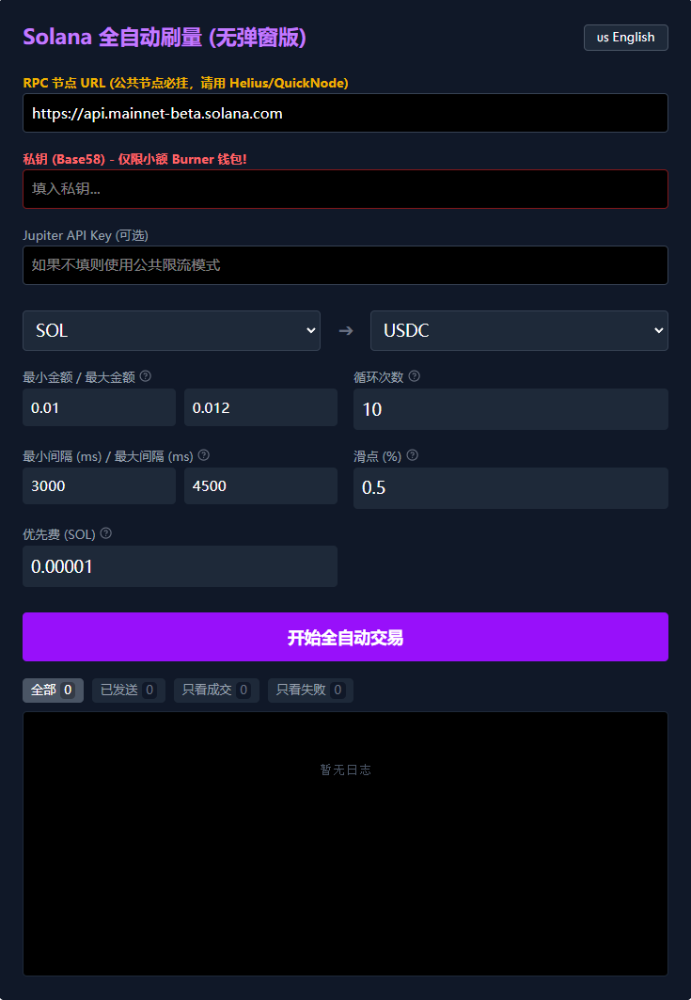

# Solana 全自动刷量交易机器人 (No-Popup)

**点击立即在线体验：** [](https://321802282.github.io/solana-auto-swap)




这是一个基于 Vite + React + TypeScript 构建的轻量级 Solana 交易机器人。它利用 Jupiter V1 API 实现自动化代币对冲交易（Ping-Pong 模式），旨在帮助用户在不需要频繁手动确认弹窗的情况下，自动完成链上交易量。

## 🚀 核心功能

- **自动化交易**：一键启动，自动执行买入和卖出循环。
- **Ping-Pong 策略**：正向交易（如 SOL -> USDC）后，自动将所得全部代币进行反向交易（USDC -> SOL），实现资金闭环。
- **无弹窗签名**：直接通过私钥本地签名并发送交易，无需与钱包插件频繁交互。
- **智能防女巫**：
  - **区间随机金额**：每次交易金额在设定的最小值和最大值之间完全随机生成。
  - **区间随机间隔**：交易等待时间在设定的最小和最大间隔之间随机取值。
- **稳健的错误处理**：
  - 反向交易失败自动跳过并重置，防止任务卡死。
  - 优化确认超时机制（10秒），提升执行效率。
- **中英文双语**：支持一键切换 UI 语言。
- **解耦设计**：逻辑、组件、常量、类型完全分离，易于二次开发。

## 🛠️ 环境要求

- [Node.js](https://nodejs.org/) (建议 v18+)
- [pnpm](https://pnpm.io/) (建议 v8+)
- 一个 Solana 钱包私钥 (建议使用仅存少量资金的 **Burner Wallet** 以保安全)
- 一个高质量的 RPC 节点 (**免费注册：** [Helius](https://www.helius.dev/))
- Jupiter API Key (**免费注册：** [Jupiter Dashboard](https://portal.jup.ag/dashboard))

## 📦 快速开始

1. **安装依赖**：
   ```bash
   pnpm install
   ```

2. **启动开发服务器**：
   ```bash
   pnpm dev
   ```

3. **访问应用**：
   打开浏览器访问 `http://localhost:5173`。

4. **配置运行**：
   - 填入你的 **RPC URL**。
   - 输入 **私钥 (Base58 格式)**。
   - 设置 **最小/最大金额**、**循环次数** 和 **最小/最大间隔时间**。
   - 点击 **"开始全自动交易"**。

## ⚠️ 免责声明

本工具仅供学习和研究使用。加密货币交易具有极高风险，请务必使用小额测试钱包。作者不对任何由于使用本脚本导致的资金损失负责。

## ☕ 捐赠

如果这个工具对你有帮助，欢迎请我喝杯咖啡！

**SOL 地址:** `FKVCYeL4sLhLTuE71f6rzc8G3YuH62m8kswbHSp33Sb6`
